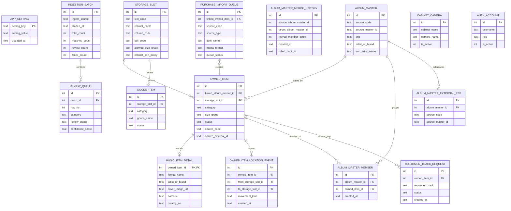

# 라이브러리 ERD 상세

이 문서는 현재 코드 기준 스키마 설명서입니다.  
기준 소스는 [app/db.py](/Volumes/Data/Works/07.__PROJECT_SLUG__/app/db.py)의 `ensure/migration` 로직이며, 문서는 최종 운영 스키마 관점으로 정리했습니다.

## 1. 스키마 범위

핵심 도메인
- 인입/검수
- 보유 상품과 상세 메타
- 장식장/슬롯과 위치 이력
- 내부 마스터와 외부 참조
- 구매 수입 큐
- 굿즈와 연계 관계
- 계정, 설정, 요청곡, 카메라

주요 코드값
- `domain_code`: `KOREA`, `JAPAN`, `GREATER_CHINA`, `WESTERN`, `OTHER_ASIA`, `WORLD_OTHER`, `UNKNOWN`
- `size_group`: `STD`, `BOOK`, `LP`, `LP10`, `LP7`, `OVERSIZE`, `CASSETTE`, `8TRACK`, `REEL_TO_REEL`, `GOODS`
- `cabinet_sort_policy`: `ARTIST_RELEASE_TITLE`, `LABEL_ID`
- `purchase_import_queue.queue_status`: `PENDING`, `CREATED`, `IGNORED`
- `review_queue.review_status`: `AUTO_APPROVED`, `NEEDS_REVIEW`, `APPROVED`, `REJECTED`

## 2. 관계도

## 3. 테이블 카탈로그

### 3-1. 운영 설정과 보조 기준

| 테이블 | PK | 대표 컬럼 | 참조 | 설명 |
| --- | --- | --- | --- | --- |
| `app_setting` | `setting_key` | `setting_value`, `updated_at` | 없음 | 자동 백업 설정과 최근 실행 상태 저장 |
| `metadata_source` | `id` | `source_code`, `source_scope`, `priority`, `enabled` | 없음 | 외부 소스 우선순위/활성 상태 |
| `classification_option` | `id` | `option_group`, `label`, `sort_order`, `is_active` | 없음 | 서브타입/사운드트랙 분류 옵션 |
| `auth_account` | `id` | `username`, `role`, `is_active` | 없음 | 관리자/현장 운영자 계정 |

### 3-2. 인입과 검수

| 테이블 | PK | 대표 컬럼 | 참조 | 설명 |
| --- | --- | --- | --- | --- |
| `ingestion_batch` | `id` | `ingest_source`, `started_at`, `completed_at`, `total_count`, `matched_count`, `review_count`, `failed_count` | 없음 | CSV 등 대량 인입 1회 단위 메타 |
| `review_queue` | `id` | `batch_id`, `row_no`, `category`, `payload_json`, `candidate_json`, `confidence_score`, `review_status`, `review_note` | `batch_id -> ingestion_batch.id` | 검수 대기/자동 승인 결과 |
| `purchase_import_queue` | `id` | `vendor_code`, `source_type`, `source_ref`, `email_from`, `email_subject`, `artist_name`, `item_name`, `media_format`, `quantity`, `unit_price`, `purchase_date`, `queue_status`, `linked_owned_item_id` | `linked_owned_item_id -> owned_item.id` | 구매 파일/메일 파싱 결과를 임시 적재 |

구매 수입 큐 운영 포인트
- 중복 판정은 `vendor_code`, `item_name`, `media_format`, `quantity`, `source_ref`, `email_subject`, `item_url`, `purchase_date`, `raw_line`, 가격 정보를 조합합니다.
- 후보 확정 후 `queue_status=CREATED`, 무시 시 `IGNORED`로 바뀝니다.

### 3-3. 위치와 장식장

| 테이블 | PK | 대표 컬럼 | 참조 | 설명 |
| --- | --- | --- | --- | --- |
| `storage_slot` | `id` | `slot_code`, `cabinet_name`, `column_code`, `cell_code`, `allowed_size_group`, `cabinet_sort_policy`, `cabinet_domain_code`, `max_thickness_mm`, `cabinet_group_name`, `cabinet_group_order`, `is_overflow_zone` | 없음 | 장식장/열/칸 구조 |
| `owned_item_location_event` | `id` | `owned_item_id`, `from_storage_slot_id`, `to_storage_slot_id`, `movement_kind`, `from_slot_display_name`, `to_slot_display_name`, `note`, `created_at` | `owned_item_id -> owned_item.id` | 위치 배치/이동/복구 이력 |
| `cabinet_camera` | `id` | `cabinet_name`, `camera_name`, `snapshot_url`, `stream_url`, `username`, `is_active` | 없음 | 장식장 연계 카메라 |

`storage_slot` 비고
- 초기에 `slot_code` 중심 구조였고, 이후 마이그레이션으로 `cabinet_name`, `column_code`, `cell_code`가 추가됐습니다.
- 실제 운영 문맥에서는 `slot_code`보다 `장식장/열/칸` 삼중 값이 더 중요합니다.

### 3-4. 보유 상품 본체

| 테이블 | PK | 대표 컬럼 | 참조 | 설명 |
| --- | --- | --- | --- | --- |
| `owned_item` | `id` | `linked_album_master_id`, `category`, `domain_code`, `release_type`, `quantity`, `size_group`, `preferred_storage_size_group`, `status`, `source_code`, `source_external_id`, `purchase_source`, `storage_slot_id`, `thickness_mm`, `notes` | `linked_album_master_id -> album_master.id`, `storage_slot_id -> storage_slot.id` | 실제 소장품 1건의 기준 테이블 |
| `music_item_detail` | `owned_item_id` | `format_name`, `artist_or_brand`, `released_date`, `barcode`, `label_name`, `catalog_no`, `cover_image_url`, `track_list_json`, `genres_json`, `styles_json`, `disc_count`, `runout_matrix_json`, `image_items_json` | `owned_item_id -> owned_item.id` | 음반 상세 메타 |
| `goods_item_detail` | `owned_item_id` | `image_urls_json`, `primary_image_url`, `poster_storage_spec`, `tshirt_size`, `cup_material`, `hat_size` | `owned_item_id -> owned_item.id` | 굿즈가 `owned_item` 흐름으로 들어온 경우의 상세 |
| `owned_item_subtype` | `id` | `owned_item_id`, `option_id` | `owned_item_id -> owned_item.id`, `option_id -> classification_option.id` | 서브타입 다중 분류 |
| `owned_item_soundtrack` | `id` | `owned_item_id`, `option_id` | `owned_item_id -> owned_item.id`, `option_id -> classification_option.id` | 사운드트랙 분류 |
| `digital_asset` | `id` | `asset_type`, `file_path`, `file_hash`, `file_size_bytes`, `duration_sec`, `metadata_json` | 없음 | 파일 자산 원본 |
| `owned_item_digital_link` | `id` | `owned_item_id`, `digital_asset_id`, `link_type`, `track_no`, `note` | `owned_item_id -> owned_item.id`, `digital_asset_id -> digital_asset.id` | 스캔/오디오/문서 링크 |

`owned_item` 비고
- 현재 조회/검색/정렬 대부분은 `owned_item.linked_album_master_id`를 바로 참조합니다.
- `master_item_id`, `copy_group_key`, `linked_artist_name`은 복제본/연계 맥락에서 보조적으로 사용됩니다.

### 3-5. 내부 마스터와 외부 참조

| 테이블 | PK | 대표 컬럼 | 참조 | 설명 |
| --- | --- | --- | --- | --- |
| `album_master` | `id` | `source_code`, `source_master_id`, `title`, `artist_or_brand`, `sort_artist_name`, `domain_code`, `release_year`, `override_domain_code`, `override_release_year`, `override_note`, `raw_json` | 없음 | 내부 작품 단위 기준 엔터티 |
| `album_master_member` | `id` | `album_master_id`, `owned_item_id`, `created_at` | `album_master_id -> album_master.id`, `owned_item_id -> owned_item.id` | 마스터-보유상품 연결 테이블 |
| `album_master_external_ref` | `id` | `album_master_id`, `source_code`, `source_master_id`, `title_hint`, `artist_or_brand_hint`, `release_year`, `raw_json` | `album_master_id -> album_master.id` | 내부 마스터와 외부 마스터의 안정적 매핑 |
| `album_master_merge_history` | `id` | `source_album_master_id`, `target_album_master_id`, `source_member_links_json`, `source_external_refs_json`, `overlap_owned_item_ids_json`, `moved_member_count`, `target_member_count`, `merged_by`, `created_at`, `rolled_back_at` | 논리적 참조 | 마스터 병합/롤백 이력 |

마스터 설계 포인트
- `owned_item.linked_album_master_id`는 현재 상태 포인터입니다.
- `album_master_member`는 멤버십과 병합/롤백 처리를 위한 정규화 연결입니다.
- `album_master_external_ref`는 한 내부 마스터가 여러 외부 마스터 출처를 가질 수 있도록 합니다.

### 3-6. 굿즈 전용 구조

| 테이블 | PK | 대표 컬럼 | 참조 | 설명 |
| --- | --- | --- | --- | --- |
| `goods_item` | `id` | `category`, `goods_name`, `quantity`, `size_group`, `storage_slot_id`, `status`, `domain_code`, `memory_note`, `image_urls_json`, `primary_image_url` | `storage_slot_id -> storage_slot.id` | 음반 외 굿즈 본체 |
| `goods_item_album_master_map` | `id` | `goods_item_id`, `album_master_id` | `goods_item_id -> goods_item.id`, `album_master_id -> album_master.id` | 굿즈-앨범 연결 |
| `goods_item_artist_map` | `id` | `goods_item_id`, `artist_name`, `normalized_artist_name` | `goods_item_id -> goods_item.id` | 굿즈-아티스트 연결 |
| `goods_item_label_map` | `id` | `goods_item_id`, `label_name`, `normalized_label_name` | `goods_item_id -> goods_item.id` | 굿즈-레이블 연결 |
| `goods_item_collectible_relation` | `id` | `goods_item_id`, `relation_type`, `linked_goods_item_id`, `note`, `display_order` | `goods_item_id -> goods_item.id`, `linked_goods_item_id -> goods_item.id` | 시리즈/변형/세트 구성 관계 |

### 3-7. 운영 로그와 요청

| 테이블 | PK | 대표 컬럼 | 참조 | 설명 |
| --- | --- | --- | --- | --- |
| `customer_track_request` | `id` | `requested_track`, `owned_item_id`, `matched_track_title`, `current_slot_code_snapshot`, `previous_slot_code_snapshot`, `status`, `requested_by`, `handled_by`, `handled_at` | `owned_item_id -> owned_item.id` | 현장 요청곡 처리 로그 |

## 4. 인덱스와 조회 포인트

대표 인덱스
- `idx_review_queue_status`
- `idx_owned_item_category_rank`
- `idx_owned_item_location_event_owned`
- `idx_album_master_lookup`
- `idx_album_master_external_ref_lookup`
- `idx_purchase_import_queue_status`
- `idx_purchase_import_queue_vendor`

조회 패턴
- 위치 조회는 `owned_item -> storage_slot -> owned_item_location_event`
- 마스터 조회는 `owned_item.linked_album_master_id`와 `album_master_member`
- 구매 수입 큐 조회는 `queue_status`, `vendor_code` 중심
- 예외 큐는 `owned_item`, `music_item_detail`, `album_master`, `storage_slot` 조합으로 계산

## 5. CSV/구매 수입과 연결되는 컬럼

CSV 대량 입력에서 직접 영향을 받는 컬럼
- `owned_item.category`
- `owned_item.source_code`
- `owned_item.source_external_id`
- `owned_item.storage_slot_id`
- `music_item_detail.artist_or_brand`
- 상품명은 생성 후보 또는 `owned_item.item_name_override` 흐름으로 반영됨
- `music_item_detail.catalog_no`
- `music_item_detail.barcode`

CSV 위치 매핑 입력 키
- `cabinet_name`
- `column_code`
- `cell_code`
- `slot_code`
- 한글 별칭: `장식장명`, `열`, `칸`, `보관슬롯`

구매 수입에서 직접 영향을 받는 컬럼
- `purchase_import_queue.vendor_code`
- `purchase_import_queue.source_type`
- `purchase_import_queue.item_name`
- `purchase_import_queue.media_format`
- `purchase_import_queue.quantity`
- `purchase_import_queue.purchase_date`
- `purchase_import_queue.linked_owned_item_id`

## 6. 문서 해석 기준

- 이 문서는 운영 중인 최종 스키마를 설명합니다.
- 초기 `CREATE TABLE` 정의와 이후 마이그레이션이 합쳐진 상태를 기준으로 읽습니다.
- 실제 배치/정렬/예외 판단은 스키마만으로 끝나지 않고 `app/db.py`의 도메인 로직을 함께 봐야 정확합니다.
