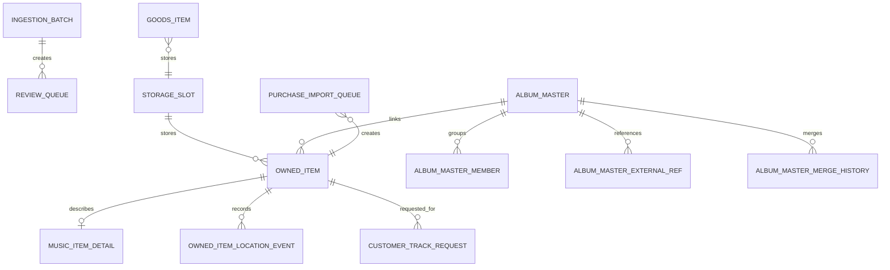

# 라이브러리 운영 ERD 요약

이 문서는 운영자와 기획자가 화면 흐름을 이해할 수 있도록 핵심 엔터티만 묶어서 설명한 요약 ERD입니다.  
실제 컬럼 단위 설명은 [library_erd.md](/Volumes/Works/07.hahahoho/docs/library_erd.md)를 기준으로 봅니다.

## 1. 한눈에 보는 구조

## 2. 운영 관점의 핵심 엔터티

`owned_item`
- 실제 소장품 본체입니다.
- 화면 대부분은 결국 이 테이블을 중심으로 조회합니다.

`music_item_detail`
- 음반 전용 상세 메타입니다.
- 커버, 트랙, 바코드, 카탈로그, 레이블, 포맷 정보가 들어갑니다.

`storage_slot`
- 장식장/열/칸 구조입니다.
- `대시보드`, `운영 홈`, 위치 추천, 예외 큐가 모두 이 구조를 참조합니다.

`owned_item_location_event`
- 위치 변경 이력입니다.
- 현재 위치 복구, 직전 위치 표시, 최근 이동 확인의 근거입니다.

`album_master`
- 내부 앨범 마스터입니다.
- 같은 작품의 LP, CD, 재발매, 수입반을 한 작품 단위로 묶는 중심입니다.

`album_master_external_ref`
- Discogs, ManiaDB, MusicBrainz 같은 외부 마스터와 내부 마스터의 연결 고리입니다.

`review_queue`
- CSV 대량 등록 이후 사람이 확인해야 하는 항목이 모이는 검수 큐입니다.

`purchase_import_queue`
- 구매 파일이나 메일에서 파싱한 주문 행이 잠시 머무는 중간 큐입니다.

## 3. 화면별로 많이 보는 테이블

`대시보드`
- `storage_slot`
- `owned_item`
- `music_item_detail`
- `owned_item_location_event`

`운영 홈`
- `owned_item`
- `music_item_detail`
- `storage_slot`
- `customer_track_request`

`검색/관리`
- `owned_item`
- `music_item_detail`
- `album_master`
- `album_master_member`
- `album_master_external_ref`

`소스 보강`
- `owned_item`
- `music_item_detail`
- `album_master`
- 외부 소스 응답 캐시/후보

`등록/수집`
- `owned_item`
- `music_item_detail`
- `review_queue`
- `purchase_import_queue`
- `album_master`

`운영/연계`
- `storage_slot`
- `cabinet_camera`
- `auth_account`
- `app_setting`

## 4. 데이터 흐름

CSV 대량 등록
1. CSV 업로드
2. `ingestion_batch` 생성
3. 각 행을 `review_queue`에 적재
4. 자동 승인 또는 수동 검수 후 `owned_item` 생성

구매 내역 가져오기
1. 주문 파일/메일 파싱
2. `purchase_import_queue`에 `PENDING` 상태로 저장
3. 후보 조회 또는 직접 생성
4. 생성되면 `linked_owned_item_id`가 연결되고 상태가 `CREATED`로 바뀜

마스터 정리
1. 외부 마스터 후보 조회
2. 내부 `album_master` 생성 또는 선택
3. `owned_item.linked_album_master_id`와 `album_master_member` 동시 정리
4. 필요 시 `album_master_merge_history`에 병합 이력 저장

배치 운영
1. `storage_slot`에서 대상 칸 조회
2. `owned_item.storage_slot_id` 갱신
3. 변경 이력을 `owned_item_location_event`에 누적

## 5. 운영자가 기억하면 좋은 포인트

- `owned_item`이 실제 재고의 기준입니다.
- `album_master`는 작품 단위 정리를 위한 상위 개념입니다.
- 위치 문제는 `storage_slot`과 `owned_item_location_event`를 같이 봐야 풀립니다.
- CSV와 구매 수입은 모두 바로 등록하지 않고 큐를 거쳐 안전하게 확정합니다.
- `goods_item`은 음반과 별도 테이블이지만 위치 구조는 `storage_slot`을 공유합니다.
