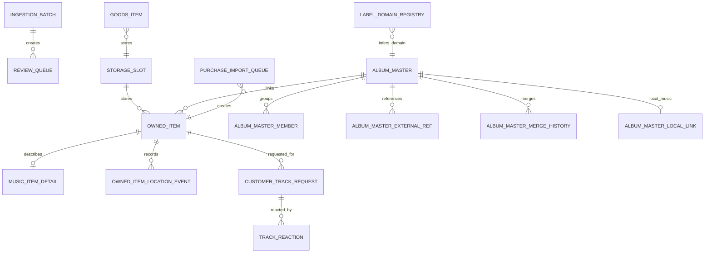

# 라이브러리 운영 ERD 요약

이 문서는 운영자와 기획자가 화면 흐름을 이해할 수 있도록 핵심 엔터티만 묶어서 설명한 요약 ERD입니다.  
실제 컬럼 단위 설명은 `docs/library_erd.md`를 기준으로 봅니다.

현재 `SCHEMA_VERSION = 15`

## 1. 한눈에 보는 구조

## 2. 운영 관점의 핵심 엔터티

`owned_item`
- 실제 소장품 본체입니다.
- 화면 대부분은 결국 이 테이블을 중심으로 조회합니다.

`music_item_detail`
- 음반 전용 상세 메타입니다.
- 커버, 트랙, 바코드, 카탈로그, 레이블, 포맷 정보가 들어갑니다.
- `disc_type`: 디스크 소재 (Standard, Picture, Shaped, Colored, Clear)
- `is_limited_edition` / `edition_number`: 한정판·에디션 정보
- `local_image_items_json`: 운영자가 직접 업로드한 앞면·뒷면·추가 이미지 목록

`storage_slot`
- 장식장/열/칸 구조입니다.
- `대시보드`, `운영 홈`, 위치 추천, 예외 큐가 모두 이 구조를 참조합니다.

`owned_item_location_event`
- 위치 변경 이력입니다.
- 현재 위치 복구, 직전 위치 표시, 최근 이동 확인의 근거입니다.

`album_master`
- 내부 앨범 마스터입니다.
- 같은 작품의 LP, CD, 재발매, 수입반을 한 작품 단위로 묶는 중심입니다.
- Spotify 매칭 정보(`spotify_album_id`, `spotify_album_uri`, `spotify_matched_at`) 포함.
- 앨범 리뷰(`review_text`, `review_source`, `review_url`)와 장르(`genres_json`, `styles_json`) 포함.

`album_master_external_ref`
- Discogs, ManiaDB, MusicBrainz 같은 외부 마스터와 내부 마스터의 연결 고리입니다.

`album_master_local_link`
- NAS 디렉터리 경로와 마스터 1:1 연결입니다.
- 로컬 플레이어 재생 경로로 사용됩니다.
- `match_confidence`: `MANUAL`(수동 연결) / `AUTO`(자동 매칭)

`label_domain_registry`
- 레이블명 → 도메인 코드 매핑 레지스트리입니다.
- 음반 등록 시 레이블명에서 도메인을 자동 추론하는 데 사용합니다.

`review_queue`
- CSV 대량 등록 이후 사람이 확인해야 하는 항목이 모이는 검수 큐입니다.

`purchase_import_queue`
- 구매 파일이나 메일에서 파싱한 주문 행이 잠시 머무는 중간 큐입니다.

`audit_log`
- 메타 수정, 위치 변경, 계정 변경 등 주요 작업의 이력을 추적합니다.

`table_device`
- Spotify Connect 등 카페 재생 디바이스 등록 테이블입니다.

`track_reaction`
- 고객이 재생 중인 곡에 남기는 리액션(좋아요 등) 기록입니다.

## 3. 화면별로 많이 보는 테이블

`대시보드`
- `storage_slot`
- `owned_item`
- `music_item_detail`
- `owned_item_location_event`

`운영 홈`
- `owned_item`
- `music_item_detail`
- `storage_slot`
- `customer_track_request`
- `track_reaction`
- `album_master_local_link` (로컬 플레이어)
- `table_device` (Spotify Connect)

`검색/관리`
- `owned_item`
- `music_item_detail` (disc_type, local_image_items_json 포함)
- `album_master` (Spotify, 리뷰, 장르 포함)
- `album_master_member`
- `album_master_external_ref`

`마스터 관리`
- `album_master`
- `album_master_member`
- `album_master_external_ref`
- `album_master_merge_history`
- `album_master_local_link`

`소스 보강`
- `owned_item`
- `music_item_detail`
- `album_master`
- `external_response_cache` (외부 API 응답 캐시)
- `metadata_source`

`등록/수집`
- `owned_item`
- `music_item_detail`
- `review_queue`
- `purchase_import_queue`
- `album_master`
- `label_domain_registry` (도메인 자동 추론)

`예외 큐`
- `owned_item`
- `music_item_detail`
- `album_master` (SPOTIFY_UNMATCHED, REVIEW_MISSING, GENRE_MISSING, LOCAL_MISSING)
- `album_master_local_link`
- `storage_slot`

`운영/연계`
- `storage_slot`
- `cabinet_camera`
- `auth_account`
- `app_setting`
- `audit_log`

## 4. 데이터 흐름

CSV 대량 등록
1. CSV 업로드
2. `ingestion_batch` 생성
3. 각 행을 `review_queue`에 적재
4. 자동 승인 또는 수동 검수 후 `owned_item` 생성

구매 내역 가져오기
1. 주문 파일/메일 파싱
2. `purchase_import_queue`에 `PENDING` 상태로 저장
3. 후보 조회 또는 직접 생성
4. 생성되면 `linked_owned_item_id`가 연결되고 상태가 `CREATED`로 바뀜

마스터 정리
1. 외부 마스터 후보 조회
2. 내부 `album_master` 생성 또는 선택
3. `owned_item.linked_album_master_id`와 `album_master_member` 동시 정리
4. 필요 시 `album_master_merge_history`에 병합 이력 저장

배치 운영
1. `storage_slot`에서 대상 칸 조회
2. `owned_item.storage_slot_id` 갱신
3. 변경 이력을 `owned_item_location_event`에 누적

Spotify 마스터 매칭
1. 마스터 패널에서 Spotify 검색
2. `album_master.spotify_album_id / uri / matched_at / image_url` 저장
3. 예외 큐 `SPOTIFY_UNMATCHED` 해소
4. 삭제: `DELETE /album-masters/{id}/spotify/match` → 필드 초기화

로컬 플레이어 연결
1. NAS 디렉터리 탐색 또는 예외 큐 `LOCAL_MISSING` 카드 클릭
2. `album_master_local_link` 생성 (local_dir_path + match_confidence)
3. 운영 홈에서 트랙 목록 조회 후 재생

## 5. 예외 큐 13종

| 종류 | 기준 | 처리 방법 |
|------|------|----------|
| `UNSLOTTED` | 슬롯 없음 | 장식장 배치 |
| `SOURCE_MISSING` | 소스 코드 없음 | 소스 코드·ID 입력 |
| `MASTER_MISSING` | 마스터 연결 없음 | 마스터 연결 |
| `COVER_MISSING` | 커버 이미지 없음 | 커버 이미지 추가 |
| `PREFERRED_SIZE_MISMATCH` | 선호 사이즈 불일치 | 사이즈 수정 |
| `MEDIA_MISSING` | 미디어 형식 없음 | 미디어 형식 입력 |
| `SIZE_MISMATCH` | 슬롯 허용 사이즈 불일치 | 슬롯 이동 또는 사이즈 수정 |
| `TRACK_MISSING` | 트랙 정보 없음 | 트랙 정보 추가 |
| `SPOTIFY_UNMATCHED` | 마스터에 Spotify 연결 없음 | Spotify 매칭 |
| `REVIEW_MISSING` | 마스터에 리뷰 없음 | 리뷰 작성 또는 URL 입력 |
| `GENRE_MISSING` | 마스터에 장르 없음 | 장르 추가 |
| `CATALOG_MISSING` | 카탈로그 번호 없음 | 카탈로그 번호 입력 |
| `LOCAL_MISSING` | 마스터에 NAS 경로 연결 없음 | NAS 디렉터리 연결 |

마스터 기준 예외(`SPOTIFY_UNMATCHED`, `REVIEW_MISSING`, `GENRE_MISSING`, `LOCAL_MISSING`)는  
카드 클릭 시 `master_id`를 전달해 마스터 패널을 열고 처리합니다.

## 6. 도메인 코드

| 코드 | 의미 |
|------|------|
| `KOREA` | 한국 |
| `JAPAN` | 일본 |
| `GREATER_CHINA` | 중화권 |
| `WESTERN` | 서양 |
| `OTHER_ASIA` | 기타 아시아 |
| `WORLD` | 공통/다국적 (현재 활성 값) |
| `UNKNOWN` | 미분류 |

`WORLD_OTHER`는 레거시 값입니다. 신규 데이터는 `WORLD`를 사용합니다.

## 7. 운영자가 기억하면 좋은 포인트

- `owned_item`이 실제 재고의 기준입니다.
- `album_master`는 작품 단위 정리를 위한 상위 개념입니다.
- 위치 문제는 `storage_slot`과 `owned_item_location_event`를 같이 봐야 풀립니다.
- CSV와 구매 수입은 모두 바로 등록하지 않고 큐를 거쳐 안전하게 확정합니다.
- `goods_item`은 음반과 별도 테이블이지만 위치 구조는 `storage_slot`을 공유합니다.
- 마스터 기준 예외 4종(Spotify, 리뷰, 장르, 로컬)은 개별 보유 상품이 아닌 마스터 1개를 수정하면 해당 마스터에 연결된 모든 보유 상품의 예외가 해소됩니다.
